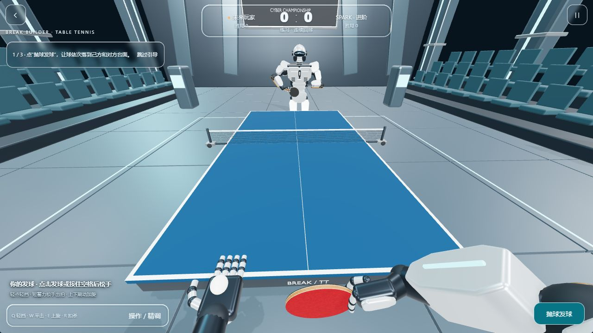

# Break Builder · Table Tennis

面向浏览器的 3D 乒乓球：用出拍时机、力量、落点与旋转完成回合，支持鼠标、键盘和触屏操作。

[在线试玩](https://play.campus3ai.xyz/table-tennis) · [主站仓库](https://github.com/liburce0412-alt/billiards) · [操作说明](https://play.campus3ai.xyz/tools) · [问题反馈](https://github.com/zjqzdhs/psychic-funicular/issues)

本仓库从原始二维 [`pong.html`](pong.html) 原型发展而来，现在包含独立的 TypeScript 物理与规则核心、
Three.js 球场、Blender 模型、输入与教学。练习和 AI 可以独立运行；好友联机由 Break Builder 主站提供账号及实时房间服务。



2026-10-07 本地浏览器小样。模型、镜头和手感仍在根据实际试玩改进。

## 玩法

| 模式     | 内容                                                   |
| -------- | ------------------------------------------------------ |
| 练习     | 持续回球，由玩家重新发球；提供可跳过、可重看的分步引导 |
| AI       | 初学、进阶、高手三档，调整反应时间、移动速度与瞄准误差 |
| 好友双人 | 从主站创建或加入房间，沿用主站账号和邀请               |

- 两套场馆：**赛博竞技馆**与**写实体育馆**。
- 系统辅助站位与备拍高度，玩家控制时机、方向、力度和旋转；辅助不保证碰到球或回球落台。
- 发球由非持拍手托球、竖直抛起，在下降时触拍；球以独立三维物体参与碰撞。
- 第一视角跟随球手站位，显示己方手臂和球拍、远侧完整对手。镜头在触球附近收敛晃动。
- 小分、胜局、发球方分别显示；离线菜单可以重开。场馆、模式和难度记忆由主站入口提供。
- 透明比分与操作面板复用主站玻璃材质、外观偏好和低画质降级。

## 怎样击球

回球先观察来球落到己方台面，再在球靠近球拍时松手出拍。轻挡、平击、上旋和扣杀具有不同拍面与动作；低球强扣、过早释放或力量过大可能造成失误。

| 操作                      | 效果                                              |
| ------------------------- | ------------------------------------------------- |
| 鼠标左右移动              | 用屏幕横向位置瞄准                                |
| 轻点左键                  | 轻挡                                              |
| 按住左键、短暂蓄力后松开  | 改变力度并挥拍                                    |
| 向上刷动 / 向下切动       | 上旋 / 下旋                                       |
| 按住 Q / W / E / R 后松开 | 分别出轻挡 / 平击 / 上旋 / 扣杀；按住时长改变力度 |
| 按住 A / D                | 临时加入侧旋，可以跨拍保持                        |
| 按住空格后松开            | 使用当前默认球技；待发球时发球                    |
| 在触屏球场一笔滑动后松手  | 挥拍；水平位置瞄准，上下动作表达旋转              |

默认球技及更细的旋转参数放在“操作 / 精调”里。回合中可直接使用手势或快捷键，
无需把鼠标移到按钮上选择动作。球场失焦、取消输入或打开菜单会取消正在准备的出拍。
挥空提示区分偏早、偏晚及无法确定原因的未接触；触球和判分反馈来自实际游戏事件。

### 练习引导

1. **发球**：球依次合法落到己方与对方台面。
2. **轻重回击**：分别完成轻球、重球的合法落台，并产生实际离拍速度差。
3. **上旋**：完成带实际上旋的回球并落到对台。

只有本人触球并满足目标才推进，选中某个球技按钮本身不算完成。失败保留当前任务；
可以跳过，在比赛菜单重新查看。完成状态保存在当前设备。练习和 AI 可重开，在线比赛不能由单方重置。

## 规则

- 单打每局 11 分、净胜两分，三局两胜；练习模式不按胜局结束。
- 每两分换发球，10 平后每分换发球。
- 发球须先落本方、再落对方台面；合法发球擦网重发，错误发球失分。
- 出界、漏接、二次落台、未落台截击等由规则核心判分。
- 局间换边，决胜局一方先得 5 分时换边。

## 独立运行

使用 Node.js 24.x（或符合依赖要求的 Node.js 22.12+）及支持 WebGL 2 的浏览器：

```sh
git clone https://github.com/zjqzdhs/psychic-funicular.git
cd psychic-funicular
npm ci
npm run dev
```

打开终端显示的本地地址。Vite 的根目录是 `demo/`，页面提供练习与 AI；单独启动开发服务器不会创建主站账号或好友房间。

```sh
npm run lint       # TypeScript
npm test           # 核心、规则、网络适配、输入与教学测试
npm run build      # 准备模型、类型检查与 Vite 构建，输出到 build/
npm run prettify   # 格式化源码与开发入口
```

`predev` / `prebuild` 自动从 `assets/models/` 准备 `public/models/table-tennis/`，
生成内容版本目录和清单。源模型缺失会报错；`.blend` 不会打进玩家资源包。

## 技术结构

| 部分              | 职责                                                        |
| ----------------- | ----------------------------------------------------------- |
| `src/core/`       | 不依赖 DOM / Three.js 的物理、规则、比赛状态与 AI           |
| `src/browser/`    | Three.js 渲染、球手与相机、输入、教学、声音、HUD 和网络适配 |
| `demo/`           | 独立开发入口                                                |
| `art/`            | Blender 制作与检查脚本                                      |
| `assets/sources/` | 可编辑 `.blend` 源文件                                      |
| `assets/models/`  | 正式 GLB                                                    |
| `test/`           | 单元与回归检查                                              |
| `docs/`           | 资产来源、接口、审计和带日期的视觉证据                      |
| `pong.html`       | 保留的原始二维原型                                          |

物理以固定 **120 Hz** 推进，处理球台、球网与运动球拍的连续碰撞、重力、空气阻力和基础旋转。
离拍速度来自来球速度、拍面法向、球拍运动与有限摩擦，动画球拍与物理拍面共同驱动接触。
当前使用运动学球拍与简化旋转模型，不是动作捕捉或职业训练模拟器。

核心坐标为 X 桌宽、Y 桌长、Z 向上；台面 1.525 × 2.74 m、高 0.76 m，球半径 0.02 m。
玩家编号贯穿整场比赛，实际方向使用 `state.ends`，换边不会交换身份。

### 嵌入页面

先提供有非零尺寸的挂载容器：

```html
<div id="game" style="height: 100dvh"></div>
```

```ts
import { mountTableTennis } from "./src/browser/index";

const game = await mountTableTennis({
  container: document.querySelector<HTMLElement>("#game")!,
  mode: "practice",
  environment: "cyber-arena",
  assetBaseUrl: "/models/table-tennis/",
});

// 容器变化时调用 game.resize()
// 暂停 / 恢复：game.pause()、game.resume()
// 离开页面或卸载组件时调用 game.dispose()
```

宿主负责加载版本化资源、提供公开玩家资料，以及退出时调用 `dispose()`。
生命周期和配置见 [`TableTennisOptions`](src/browser/types.ts)。共享宿主的同一份 Three.js，避免重复渲染依赖。
联机模式的 `pause()` 只暂停本地输入，服务器对局继续推进，不能单方面暂停比赛。

### 核心 API

```ts
import { createMatch, applyInput, stepMatch, createSnapshot } from "./src/core";

const state = createMatch({ mode: "ai", difficulty: "medium", seed: 42 });
applyInput(state, 0, { kind: "serve", seq: 0, aimX: 0, power: 0.5, spin: 0 });
stepMatch(state); // 推进一个 1/120 秒步长
const snapshot = createSnapshot(state);
```

浏览器模式为 `practice | ai | online`；核心双人模式名为 `friend`，不会自动控制双方。
输入序号按玩家递增，重连后从快照的 `lastInputSeq + 1` 继续。
每个 tick 的事件须在下一步前消费，可用于触球音效、教学和比分展示。

## 主站接入与联机

| 本仓库                           | Break Builder 主站               |
| -------------------------------- | -------------------------------- |
| 独立游戏、模型、输入、物理和规则 | 账号、头像、好友、邀请与房间入口 |
| 客户端预测、快照校正与显示       | WebSocket 鉴权和权威房间         |
| 本地练习与 AI                    | 联机发球、计分和比赛结果保存     |

主站以 `packages/table-tennis` 子模块固定本仓库提交，模型与音频随主站同源发布。
服务端每秒更新 60 次，每次执行两个物理子步，约每秒发送 30 次快照。
客户端不提交权威比分；断线保留 30 秒重连窗口，未完成的一分重发，超时判负。

独立页面接入 `online` 需要宿主提供已鉴权的 WebSocket 地址，不能仅改变 `mode` 就获得联机服务。
浏览器与服务端需要兼容的协议版本。主站入口、后端和发布方式见[主仓库 README](https://github.com/liburce0412-alt/billiards#readme)。

更新流程：先在本仓库提交并推送，再更新主站子模块指针并构建发布；不要让线上构建自动追踪浮动 `main`。

## 模型制作与当前进展

球手、球台球网、球拍、球及两套场馆由 Blender 制作，保存可编辑源与 GLB。
Blender MCP 用于读取场景、修改、视口检查和导出；它只在开发时使用，不是玩家运行依赖。
制作脚本用于复现，视觉检查与游戏内表现分别记录，不能以成功导出代替质量验收。
详见[资产来源与制作说明](docs/assets.md)。

2026-10-07 修正了肩根脱离身体、手腕求解、躯干转轴和镜头位置；补充直接出拍、教学达成判据、失误提示和菜单重开。
相关记录：[操作与教学审计](docs/audit/2026-10-07-controls.md)、[机器人审计](docs/audit/2026-10-07-robot.md)。

仍需改进和实际试玩确认的部分：

- 连续挥拍的自然程度、近眼右前臂偏大，以及白球在部分光照下的体积感。
- 教程后两步的实际难度、连续回合节奏和移动端舒适度。
- 本版本的真实手机性能及公网跨设备联机表现。

[历史本地验证](docs/validation.md)有独立的提交、资源和设备范围，不代表新版本全部重测通过。
首版范围是练习、AI 和好友单打，不包含双打、排位或商城。

## 来源与许可

原始 `pong.html` 保留原作者内容。原仓库未提供许可文件，本次没有擅自替原作增加或变更许可证；
接入 GPL 主站也不自动改变本仓库原有许可范围。第三方模型、贴图和音频须单独记录来源和授权。

提交反馈时，请尽量附上玩法、设备/浏览器、操作方式和截图或短视频，便于复现具体回合。
